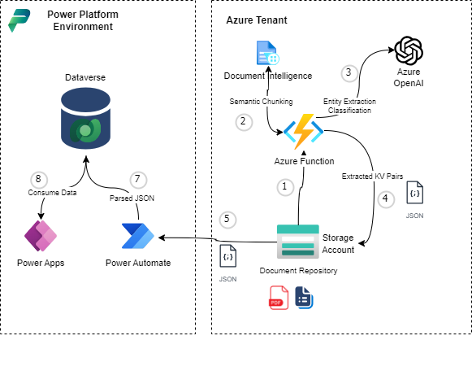
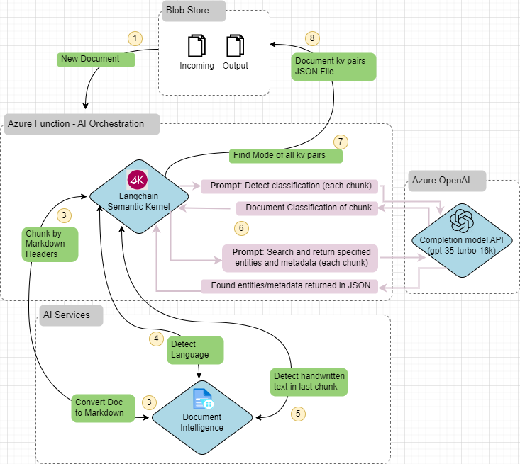

# ドキュメントの取り込み、メタデータ抽出、eArchiveリクエストの自動化

このプロジェクトでは、Azure AI Document Intelligence と Azure OpenAI を使用して、eArchive の目的で研究ドキュメントから関連する詳細と分類を抽出する方法を示すソリューションの例を提供します。 その目的は、ユーザーがダウンストリームシステムでドキュメントをeArchiveするように要求するときにドキュメントについて記入する必要がある手動フォームを、そのドキュメントのアップロードによってトリガーされる自動化されたプロセスに置き換えることです。 

## アーキテクチャー

このソリューションには、トリガーと出力の両方に Azure Blob Storage バインドを備えた Durable Azure 関数、初期ドキュメント処理のための Azure AI Document Intelligence の使用、セクション チャンクからのより複雑なエンティティと分類の抽出のための Azure OpenAI が含まれています。その結果、キーと値のペアのフラット化された JSON ドキュメントが作成され、解析されて Dataverse に送信され、ユーザーからフォームでキャプチャされた詳細を含む eArchive 要求が記録されます。

## Function AppとSemantic Kernelを用いたAIオーケストレーション

このソリューションには、Azure OpenAI へのプロンプト関数呼び出しを定義および調整するために Python で開発された Azure 関数アプリにデプロイされた BLOB トリガー持続関数と、Azure AI Document Intelligence サービスへの呼び出しを実行するためのその他のライブラリが含まれています。

1. BLOB ストレージにアップロードされたドキュメントが Azure Durable Function をトリガーする
  
Python関数は、LangchainとAIサービスドキュメントインテリジェンスを使用:
2. ドキュメントをマークダウンに変換する
3. 見出しでチャンクに分割
4. 言語の検出
5. 手書きのテキスト(署名)の存在を特定する
  
6. Python 関数は、セマンティック カーネルを使用して、セマンティック (プロンプト) 関数を Azure OpenAI チャット完了サービスに調整:
    * ドキュメント チャンクからのドキュメント タイプの分類
    * ドキュメントチャンクから関心のあるエンティティとメタデータを抽出します
  
7. Python関数は、TypingライブラリとListライブラリを使用して、
チャンクから抽出されたエンティティの合成モードを使用して、さまざまなエンティティ/メタデータとフォームの最も可能性の高い正しい値をフラット化されたJSONに返します
  
9. 結果の JSON ファイルは、ダウンストリーム処理のために BLOB ストレージに格納されます

リファレンスドキュメント:

* [Semantic Kernel GitHub Repo](https://github.com/microsoft/semantic-kernel/tree/main)
* [Getting Started with Semantic Kernel (Python)](https://github.com/microsoft/semantic-kernel/blob/main/python/README.md)
* [Understanding the Kernel in Semantic Kernel](https://learn.microsoft.com/en-us/semantic-kernel/agents/kernel/?tabs=python)
* [Adding AI Services to the Kernel](https://learn.microsoft.com/en-us/semantic-kernel/agents/kernel/adding-services?tabs=python)

## Power Platform コンポーネント
詳細は [Power Platform セクション](./powerplat/readme.md) を参照して下さい。

# デプロイ手順

1. Azure サブスクリプションで Azure 関数アプリを作成する
2. Azure サブスクリプションでストレージ アカウントを作成する
3. Azure Blob Storage の接続文字列など、必要なアプリケーション設定を使用して Azure Function App を構成します。必要な設定については、local.settings.example.jsonを参照してください
4. 関数コードを Azure Function App にデプロイする
5. [Power Platform セクション](/powerplat/readme.md) の指示に従い Power Platform ソリューションを展開します。

**リファレンスドキュメント:**

* [Manage your function app](https://learn.microsoft.com/en-us/azure/azure-functions/functions-how-to-use-azure-function-app-settings?tabs=portal)
* [App Configuration references](https://learn.microsoft.com/en-us/azure/app-service/app-service-configuration-references?toc=%2Fazure%2Fazure-functions%2Ftoc.json)
* [Develop Azure Functions by using Visual Studio Code](https://learn.microsoft.com/en-us/azure/azure-functions/functions-develop-vs-code?tabs=node-v4%2Cpython-v2%2Cisolated-process&pivots=programming-language-python)
